# Лабораторная работа №5 — Безопасность WordPress

> **Версия WordPress:** 6.9.4  
> **Среда:** XAMPP v3.3.0 (Apache + MariaDB 10.4.32)  
> **Плагин безопасности:** All In One WP Security & Firewall (AIOS)

---

## Содержание

1. [Цель работы](#1-цель-работы)
2. [Шаг 1 — Подготовка среды](#2-шаг-1--подготовка-среды)
3. [Шаг 2 — Управление ролями и паролями](#3-шаг-2--управление-ролями-и-паролями)
4. [Шаг 3 — Обновления](#4-шаг-3--обновления)
5. [Шаг 4 — Базовое hardening](#5-шаг-4--базовое-hardening)
6. [Шаг 5 — Установка и настройка AIOS](#6-шаг-5--установка-и-настройка-aios)
7. [Шаг 6 — Проверка защиты от брутфорса](#7-шаг-6--проверка-защиты-от-брутфорса)
8. [Шаг 7 — Восстановление из резервной копии](#8-шаг-7--восстановление-из-резервной-копии)
9. [Ответы на контрольные вопросы](#9-ответы-на-контрольные-вопросы)

---

## 1. Цель работы

Закрепить ключевые практики безопасности WordPress: управление ролями и паролями, обновления, базовое hardening (`wp-config.php`, права доступа, отключение редактора), резервное копирование, мониторинг активности и поэтапная настройка плагина All In One WP Security & Firewall (AIOS) для защиты от брутфорса, базового WAF и контроля прав.

---

## 2. Шаг 1 — Подготовка среды

### 2.1. Запуск WordPress

Запущен XAMPP Control Panel, активированы модули **Apache** и **MySQL**. Административная панель WordPress доступна по адресу `http://localhost/wordpress/wp-admin`. Доступ администратора подтверждён — в боковом меню отображаются все разделы управления.

> **Отличие WordPress 6.9:** В верхней панели администратора появилась **командная палитра** (вызывается по `Ctrl+K`) — быстрый поиск по всем разделам сайта. Функциональность самого интерфейса при этом не изменилась.

<!-- СКРИНШОТ: Административная панель WordPress с подтверждённым доступом администратора -->
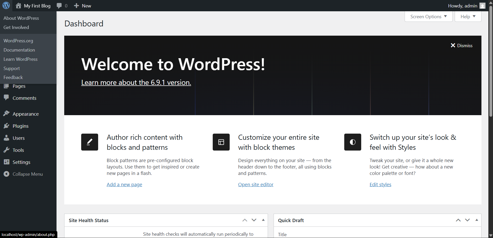

---

### 2.2. Включение режима отладки

В файл `wp-config.php` (расположен в корне WordPress: `C:\xampp\htdocs\wordpress\wp-config.php`) добавлена директива:

```php
define('WP_DEBUG', true);
```

Строка добавлена перед блоком `/* That's all, stop editing! */`. После сохранения сайт продолжает работать в штатном режиме.

<!-- СКРИНШОТ: Файл wp-config.php с добавленной строкой WP_DEBUG -->
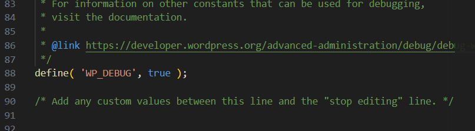

---

## 3. Шаг 2 — Управление ролями и паролями

### 3.1. Создание тестового пользователя

Путь: **Пользователи → Добавить нового пользователя**

Создан тестовый пользователь со следующими параметрами:

| Параметр | Значение |
|---|---|
| Имя пользователя | `test_author` |
| Email | `test@example.local` |
| Роль | Автор |
| Пароль | Сгенерирован WordPress (надёжный) |

<!-- СКРИНШОТ: Форма добавления пользователя с заполненными полями -->
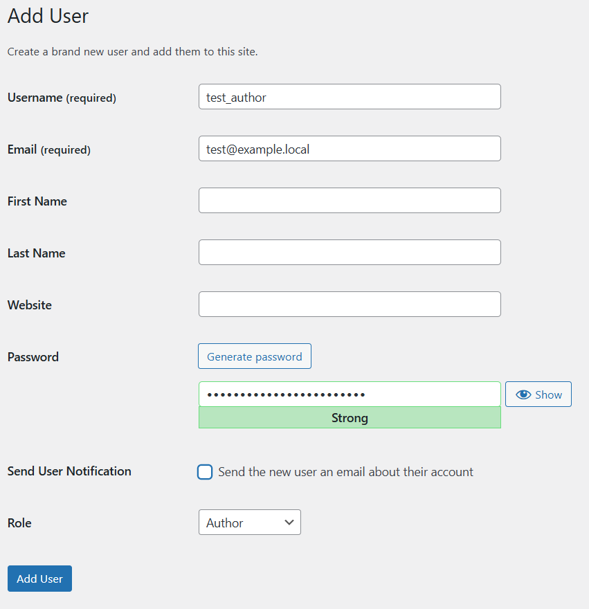

<!-- СКРИНШОТ: Список пользователей с созданным test_author -->
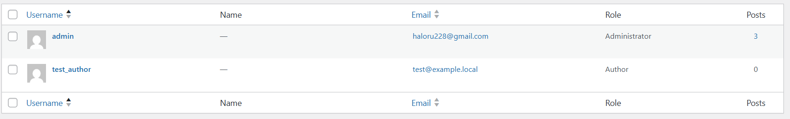

---

### 3.2. Проверка пароля администратора

Путь: **Пользователи → Все пользователи → Изменить** (для администратора)

В секции «Управление аккаунтом» индикатор надёжности пароля показывает статус **«Надёжный»**. Пароль содержит заглавные и строчные буквы, цифры и специальные символы (8+ символов).

<!-- СКРИНШОТ: Страница редактирования администратора с индикатором надёжного пароля -->
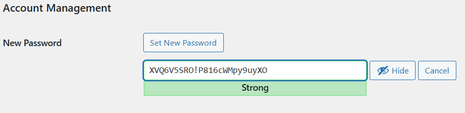

---

## 4. Шаг 3 — Обновления

### 4.1. Проверка и установка обновлений

Путь: **Консоль → Обновления**

> **Отличие WordPress 6.9:** Установлена версия **WordPress 6.9.4** — актуальная на момент выполнения работы. Страница обновлений отображает сообщение «Вы используете последнюю версию WordPress». Обновление ядра не требуется.

Для плагинов и тем были применены все доступные обновления.

<!-- СКРИНШОТ: Страница обновлений с сообщением об актуальной версии WordPress -->
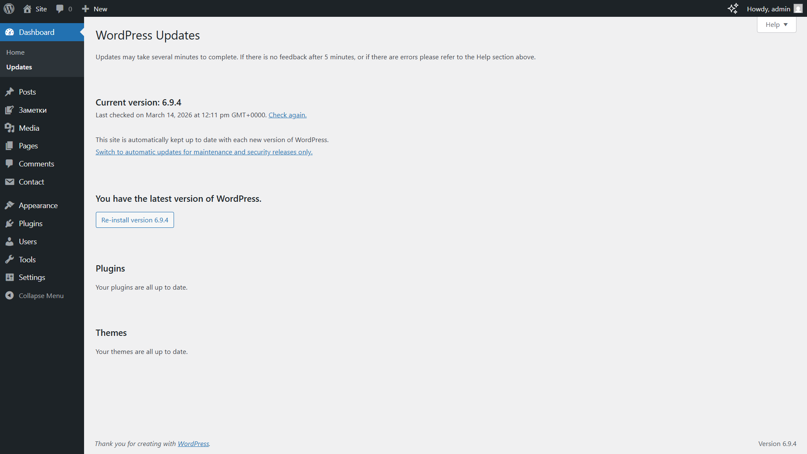

---

### 4.2. Настройка автоматических обновлений

**Плагины:** Путь **Плагины → Установленные плагины**  
Для каждого плагина нажата ссылка **«Включить автоматическое обновление»**.

**Темы:** Путь **Внешний вид → Темы**  
Для каждой темы в окне просмотра нажата кнопка **«Включить автоматические обновления»**.

<!-- СКРИНШОТ: Список плагинов с включёнными автообновлениями -->
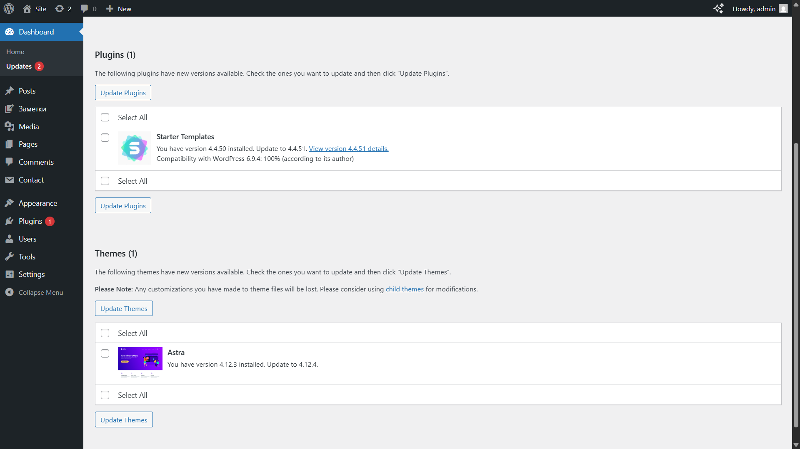

---

## 5. Шаг 4 — Базовое hardening

### 5.1. Запрет редактирования файлов (DISALLOW_FILE_EDIT)

В файл `wp-config.php` добавлена директива:

```php
define('DISALLOW_FILE_EDIT', true);
```

<!-- СКРИНШОТ: Файл wp-config.php с добавленной строкой DISALLOW_FILE_EDIT -->
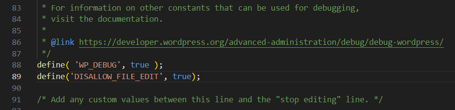

> **Отличие WordPress 6.9:** В новых версиях WordPress с блочными темами (Twenty Twenty-Four и новее) пункт «Редактор тем» в классическом понимании и так не отображается — блочные темы редактируются через Site Editor. Поэтому визуально исчезновение пункта меню после добавления директивы может быть неочевидным.  
>  
> **Подтверждение работы директивы:** При установке классической темы (например, Twenty Twenty-One) пункт **Внешний вид → Редактор** полностью исчезает из меню. Кроме того, плагин AIOS в разделе «Disable PHP file editing» отображает сообщение: *«The DISALLOW_FILE_EDIT constant has already been defined»* — это подтверждает, что защита активна.

<!-- СКРИНШОТ: Сообщение AIOS о том что DISALLOW_FILE_EDIT уже определена -->
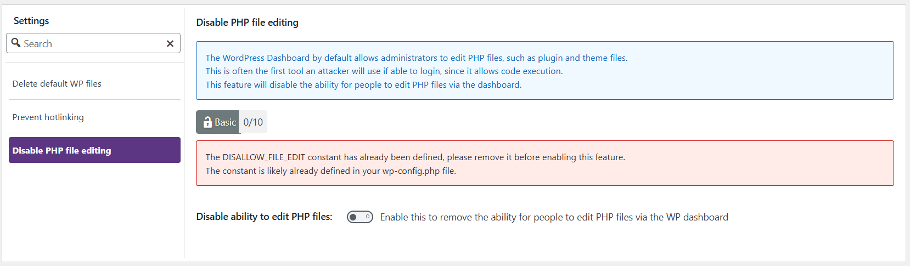

---

### 5.2. Настройка прав доступа к файлам и папкам

Права выставлены через AIOS (Шаг 5 → Filesystem Security):
- **Папки:** `755` (rwxr-xr-x)
- **Файлы:** `644` (rw-r--r--)

На локальном Windows-сервере (XAMPP) реальные Unix-права применяются через инструмент AIOS — таблица File Permissions показывает все строки с зелёным статусом.

---

### 5.3. Защита wp-config.php через .htaccess

В файл `.htaccess` (корень WordPress) добавлен блок:

```apache
# Защита wp-config.php от прямого доступа
<files wp-config.php>
    order allow,deny
    deny from all
</files>
```

> **Важно:** директивы обязательно должны быть обёрнуты в теги `<files wp-config.php>`. Без них `deny from all` применяется ко всему сайту и блокирует все страницы (ошибка 403).

**Проверка:** попытка открыть `http://localhost/wordpress/wp-config.php` возвращает ошибку **403 Forbidden**. Остальной сайт работает нормально.

<!-- СКРИНШОТ: Содержимое .htaccess с добавленным блоком защиты -->
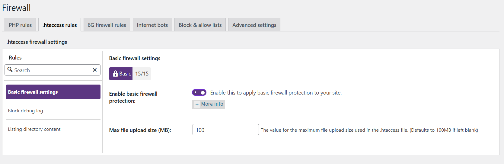

<!-- СКРИНШОТ: Браузер с ошибкой 403 при обращении к wp-config.php -->
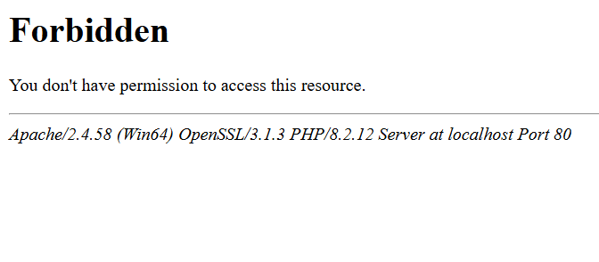

---

## 6. Шаг 5 — Установка и настройка AIOS

### 6.1. Установка плагина

Путь: **Плагины → Добавить новый плагин**

> **Отличие WordPress 6.9:** Пункт меню переименован — теперь **«Добавить новый плагин»** (в старых версиях было просто «Добавить новый»).

Найден и установлен плагин **All In One WP Security & Firewall**. После активации в боковом меню появился раздел **WP Security**.

<!-- СКРИНШОТ: Плагин AIOS в списке установленных плагинов (активирован) -->
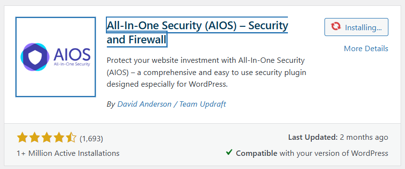

---

### 6.2. User Login — Login Lockdown

Путь: **WP Security → User Login → Login Lockdown**

Включена опция **«Enable Login Lockdown Feature»**. Настроены следующие параметры:

| Параметр | Значение |
|---|---|
| Max Login Attempts | 5 |
| Login Retry Time Period | 15 минут |
| Time Length of Lockout | 30 минут |

<!-- СКРИНШОТ: Форма Login Lockdown с заполненными параметрами -->
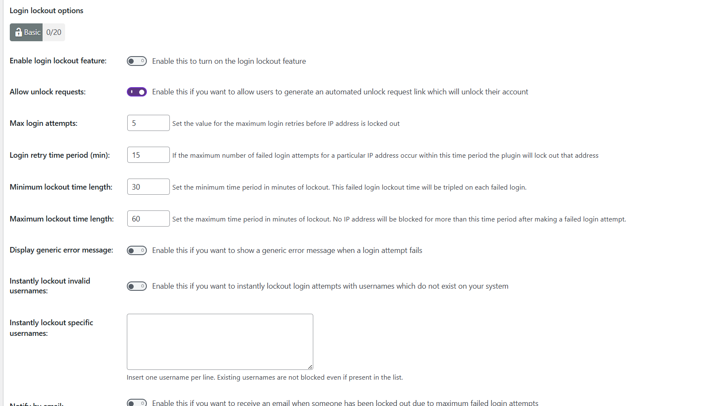

---

### 6.3. User Login — Force Logout

Путь: **WP Security → User Login → Force Logout**

Включена опция **«Enable Force WP User Logout»**. Задано значение **1440 минут** (24 часа) — ограничивает максимальное время жизни сессии.

<!-- СКРИНШОТ: Настройки Force Logout с заданным значением 1440 минут -->
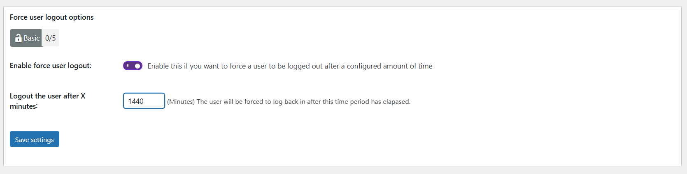

---

### 6.4. User Accounts

Путь: **WP Security → User Accounts**

AIOS проверил все учётные записи на использование логина `admin`. Пользователя с таким логином не обнаружено — учётная запись администратора использует уникальный логин.

<!-- СКРИНШОТ: Раздел User Accounts без предупреждений об admin -->
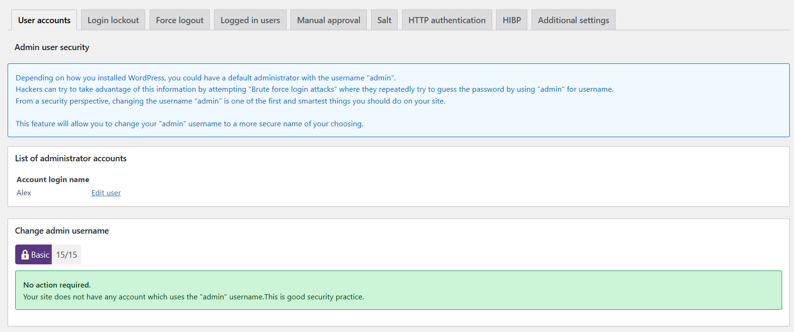

---

### 6.5. User Registration

Путь: **WP Security → User Registration**

Публичная регистрация на сайте отключена (**Настройки → Общие → Членство** — галочка снята). Настройка ручного одобрения регистраций не применялась, так как регистрация пользователей закрыта.

---

### 6.6. Filesystem Security

Путь: **WP Security → Filesystem Security → File Permissions**

AIOS отобразил таблицу с текущими и рекомендованными правами доступа. Для файлов с отклонениями нажата кнопка **«Set Recommended Permission»**. Все строки таблицы получили зелёный статус (см. Рисунок 9).

---

### 6.7. Firewall

Путь: **WP Security → Firewall → Basic Firewall Rules**

Включены следующие опции:

| Опция | Статус |
|---|---|
| Enable Basic Firewall Protection | ✅ Включено |
| Enable Filtering of Suspicious Query Strings | ✅ Включено |
| Enable Advanced Character String Filter (XSS) | ✅ Включено |
| Disable Directory Browsing | ✅ Включено |

После включения проверена работоспособность сайта — все страницы открываются корректно.

<!-- СКРИНШОТ: Раздел Firewall с включёнными опциями -->
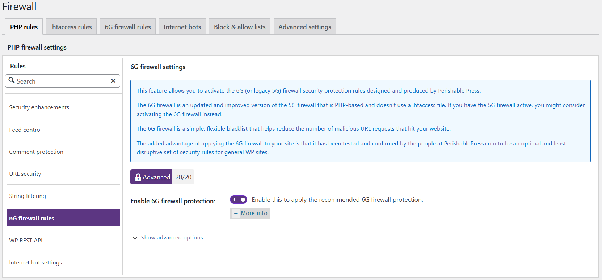

---

### 6.8. Brute Force — Rename Login Page

Путь: **WP Security → Brute Force → Rename Login Page**

Включена опция **«Enable Rename Login Page Feature»**. Стандартный URL `/wp-login.php` заменён на нестандартный slug. Новый URL сохранён в менеджере паролей.

**Проверка:** попытка открыть `http://localhost/wordpress/wp-login.php` возвращает ошибку **404 Not Found**.

<!-- СКРИНШОТ: Поле с новым URL страницы входа -->
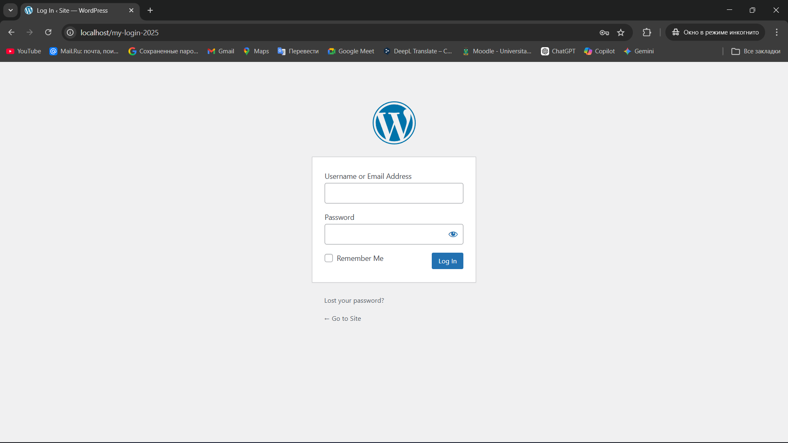

<!-- СКРИНШОТ: Ошибка 404 при попытке открыть wp-login.php -->
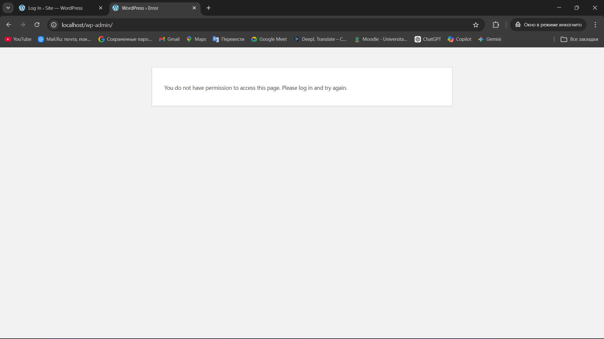

---

### 6.9. Scanner — File Change Detection

Путь: **WP Security → Scanner → File Change Detection**

Включена автоматическая проверка изменений файлов:
- Периодичность сканирования: **Once Daily**
- Email для уведомлений: задан адрес администратора
- Выполнено первоначальное сканирование кнопкой **«Perform Scan Now»** — AIOS зафиксировал контрольный список файлов

<!-- СКРИНШОТ: Настройки File Change Detection с включёнными опциями -->
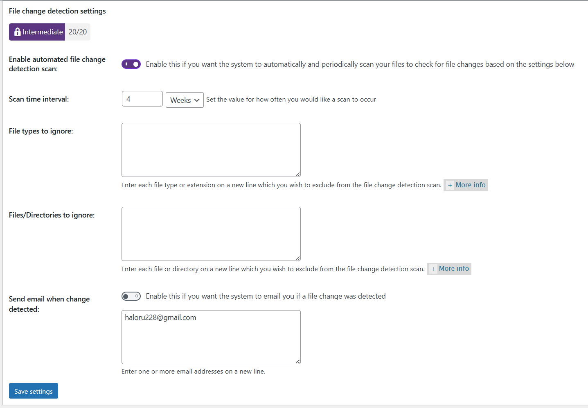

---

### 6.10. Database Security — DB Backup

Путь: **WP Security → Database Security → DB Backup**

Создана резервная копия базы данных кнопкой **«Create DB Backup Now»**. Файл в формате SQL сохранён вне директории WordPress (на рабочем столе). Настроено расписание автоматического резервного копирования: **Weekly**, с отправкой на email администратора.

<!-- СКРИНШОТ: Раздел DB Backup после создания резервной копии -->
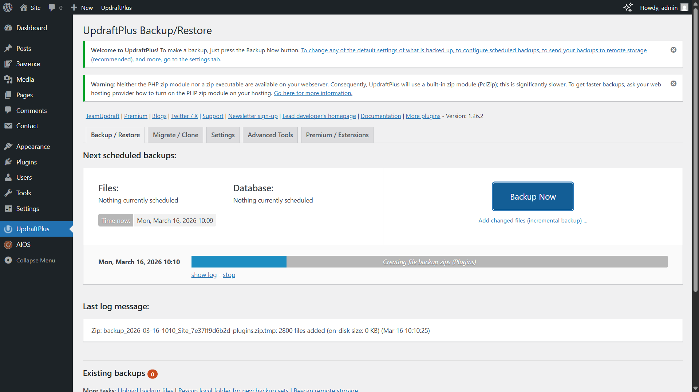

---

## 7. Шаг 6 — Проверка защиты от брутфорса

### 7.1. Ход проверки

Проверка выполнялась в режиме инкогнито браузера (Ctrl+Shift+N) для исключения влияния активной сессии администратора.

1. Открыт новый URL страницы входа (заданный в Шаге 6.8)
2. Введён логин `test_author` с неверным паролем — выполнено **6 попыток подряд**
3. После 5-й попытки система отобразила сообщение о блокировке

<!-- СКРИНШОТ: Сообщение о блокировке на странице входа -->
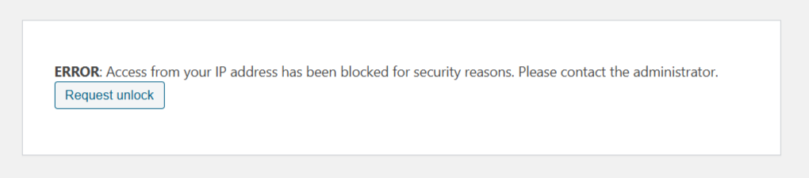

---

### 7.2. Результаты

Путь: **WP Security → Dashboard → Locked IP Addresses**

В таблице заблокированных IP появилась запись с IP-адресом, временем блокировки и количеством неудачных попыток. После проверки IP разблокирован кнопкой **«Unlock»**.

<!-- СКРИНШОТ: Таблица Locked IP Addresses с заблокированным IP -->
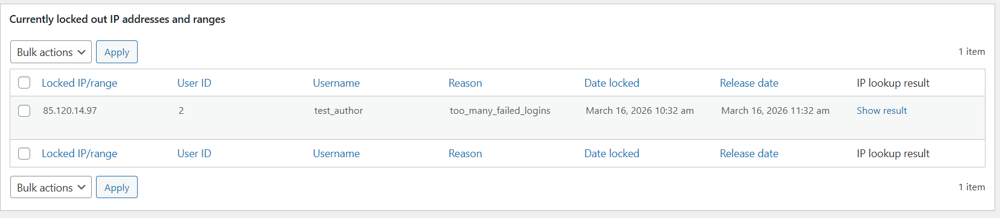

---

## 8. Шаг 7 — Восстановление из резервной копии

### 8.1. Удаление тестовых данных

**Запись:** Путь **Записи → Все записи** — выбрана запись и перемещена в корзину. Корзина очищена (Корзина → Очистить корзину), чтобы удаление было окончательным.

**Изображение:** Путь **Медиафайлы → Библиотека** — выбрано изображение и удалено безвозвратно через «Удалить безвозвратно».

<!-- СКРИНШОТ: Список записей после удаления (запись отсутствует) -->
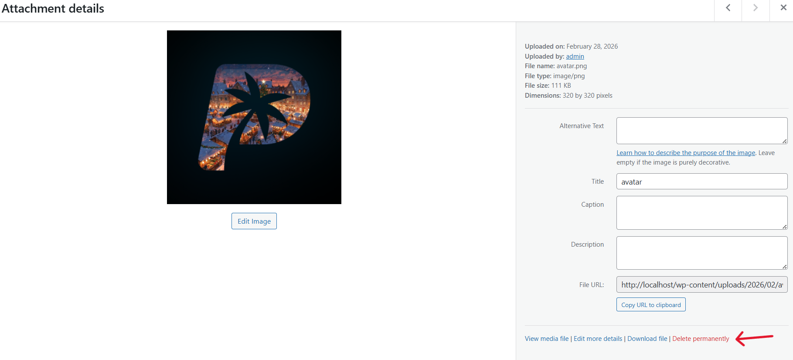

---

### 8.2. Восстановление базы данных

Резервная копия восстановлена через **phpMyAdmin** (`http://localhost/phpmyadmin`):

1. Выбрана база данных WordPress в левой панели
2. Открыта вкладка **«Импорт»**
3. Выбран SQL-файл бэкапа (созданный в Шаге 6.10)
4. Нажата кнопка **«Вперёд»** (Go)
5. Получено сообщение об успешном завершении импорта

<!-- СКРИНШОТ: phpMyAdmin с сообщением об успешном импорте -->
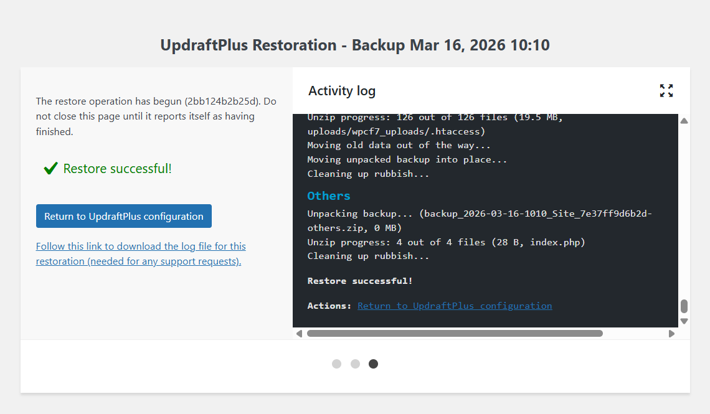

---

### 8.3. Проверка целостности данных

После восстановления выполнена проверка:

| Проверка | Результат |
|---|---|
| Удалённая запись в разделе Записи | ✅ Восстановлена |
| Удалённое изображение в Медиафайлах | ✅ Восстановлено |
| Главная страница сайта | ✅ Работает корректно |
| Учётная запись test_author | ✅ Существует |

<!-- СКРИНШОТ: Список записей с восстановленной записью -->
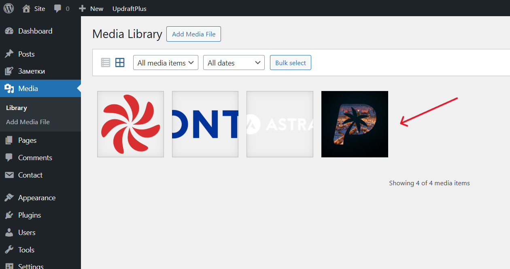

---

## 9. Ответы на контрольные вопросы

### Вопрос 1. Почему `DISALLOW_FILE_EDIT` и правильные права на `wp-config.php` существенно уменьшают риск пост-эксплойта?

**`DISALLOW_FILE_EDIT`** устраняет один из наиболее распространённых векторов пост-эксплойта в WordPress — встроенный редактор файлов тем и плагинов. Если злоумышленник получает доступ к административной панели (через похищенные учётные данные, XSS-атаку или перехват сессии), он не сможет внедрить вредоносный PHP-код через браузерный интерфейс. Для размещения веб-шелла или бэкдора ему понадобится отдельный доступ к файловой системе сервера через FTP или SSH — это существенно повышает стоимость атаки.

**Защита `wp-config.php`** через `.htaccess` решает другую задачу: предотвращает прямое чтение файла конфигурации по HTTP. Этот файл содержит учётные данные базы данных, секретные ключи WordPress и соль для хешей паролей. При ошибке конфигурации веб-сервера (например, временном отключении обработки PHP) файл мог бы отдаваться клиентам как открытый текст. Директива `deny from all` исключает эту возможность независимо от состояния PHP.

Вместе обе меры реализуют принцип **Defence in Depth** («глубокой обороны»): атакующему недостаточно взломать один уровень защиты — каждый дополнительный барьер увеличивает сложность и стоимость атаки.

---

### Вопрос 2. Какие параметры Login Lockdown/Firewall выбраны и почему?

**Login Lockdown:**

| Параметр | Значение | Обоснование |
|---|---|---|
| Max Login Attempts | 5 | Легитимный пользователь делает 1–3 попытки при ошибке. 5 — достаточный запас без риска самоблокировки. При автоматизированной атаке лимит исчерпывается мгновенно. |
| Login Retry Period | 15 мин | Скользящее окно ограничивает скорость перебора до ~20 попыток/час с одного IP — при типичных паролях это делает подбор практически нереальным. |
| Lockout Time | 30 мин | Достаточно длинный срок чтобы сделать ручной подбор нерентабельным, но не настолько большой чтобы создать серьёзные неудобства для легитимного пользователя. |
| Force Logout | 1440 мин | Ограничивает время жизни сессии до 24 часов. Защита от кражи сессионного cookie через XSS или перехват в открытой сети. |

**Firewall:** Выбран базовый уровень (Basic Firewall) как наименее инвазивный — не нарушает работу плагинов и тем, при этом блокирует наиболее распространённые автоматизированные атаки. Включение XSS-фильтра и защиты от Bad Query Strings добавляет слой проверки на уровне `.htaccess` до того, как запрос достигает PHP-кода WordPress.

---

### Вопрос 3. Чем отличаются меры защиты на уровне WordPress от мер на уровне веб-сервера и ОС?

Защита строится послойно, каждый уровень решает свои задачи:

| Уровень | Инструменты | Что защищает | Ограничения |
|---|---|---|---|
| **WordPress** (приложение) | AIOS, плагины, надёжные пароли, обновления | Логику приложения: брутфорс, CSRF, XSS, вредоносные плагины | Перестаёт работать если WP скомпрометирован |
| **Веб-сервер** (Apache/Nginx) | `.htaccess`, ModSecurity, HTTP-заголовки | HTTP-трафик, доступ к файлам и директориям | Не знает о логике приложения |
| **ОС и сеть** | `iptables`, `fail2ban`, `UFW`, `SELinux` | Сетевые атаки, несанкционированный доступ к ОС | Не анализирует содержимое HTTP-запросов |

**Ключевое различие:** защита на уровне ОС и веб-сервера работает независимо от состояния WordPress — даже при полном взломе CMS брандмауэр ОС и правила Apache продолжают работать. Защита на уровне плагинов прекращает работу при компрометации самого движка.

Правильная стратегия предполагает многоуровневую защиту: ограничения ОС → веб-сервер → приложение. Нельзя ограничиваться только одним слоем.

---

### Вопрос 4. Что обязательно включать в «полный» бэкап WP и как проверить восстановление?

**Состав полного резервного копирования:**

| Компонент | Содержимое | Метод |
|---|---|---|
| **База данных** (SQL-дамп) | Все записи, страницы, комментарии, пользователи, настройки плагинов и тем, метаданные | `mysqldump` / phpMyAdmin / AIOS |
| **wp-content/uploads/** | Загруженные медиафайлы (изображения, документы, видео) | rsync / FTP / архив |
| **wp-content/themes/** | Файлы активной и установленных тем | rsync / FTP / архив |
| **wp-content/plugins/** | Файлы установленных плагинов | rsync / FTP / архив |
| **wp-config.php** | Учётные данные БД, секретные ключи | Безопасное хранилище (не в веб-корне) |
| **.htaccess** | Правила веб-сервера | В составе архива файлов |
| **wp-content/mu-plugins/** | Must-use плагины (если есть) | rsync / FTP / архив |

> Папки `wp-admin/` и `wp-includes/` можно не включать — они полностью восстанавливаются при переустановке WordPress.

**Хранение бэкапов:**
- Хранить **вне веб-корня** — файл не должен быть доступен по HTTP
- Хранить **на отдельном носителе** (облако, внешний диск) — защита от отказа основного диска
- Проверять бэкапы **регулярно** (раз в месяц разворачивать на тестовой среде)

**Как правильно проверить восстановление:**
1. Развернуть бэкап на **изолированной тестовой среде** (`localhost/test-restore`), не на основном сайте
2. Проверить доступность всех записей, страниц, медиафайлов и пользовательских аккаунтов
3. Убедиться в работоспособности плагинов и тем
4. Проверить что адрес сайта в БД совпадает с адресом тестовой среды (`wp_options` → `siteurl`, `home`)
5. Зафиксировать **время восстановления** (RTO — Recovery Time Objective)

В данной работе восстановление проверено путём удаления записи и изображения с последующим импортом SQL-дампа через phpMyAdmin — оба элемента были успешно восстановлены (см. Рисунки 25–26).

---

## Примечания по WordPress 6.9

В ходе выполнения работы был обнаружен ряд отличий WordPress 6.9.4 от версий, на которые ориентировано задание:

| Пункт задания | Ожидалось | Фактически в WP 6.9.4 |
|---|---|---|
| Проверка исчезновения «Редактора» | Внешний вид → Редактор пропадает | Site Editor остаётся, исчезает только файловый редактор (актуально для классических тем) |
| Страница обновлений | Обновить WordPress | WP 6.9.4 — уже актуальная версия, обновление ядра не требуется |
| «Добавить новый» плагин | «Плагины → Добавить новый» | Переименовано в «Плагины → Добавить новый плагин» |
| DISALLOW_FILE_EDIT в AIOS | Можно включить через AIOS | AIOS сообщает что константа уже определена вручную — это нормальное поведение |

---

*Работа выполнена индивидуально. Все скриншоты сделаны в процессе выполнения лабораторной работы.*
