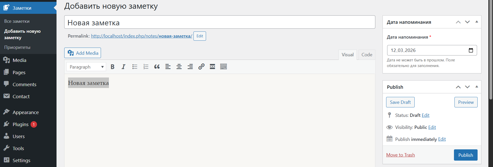
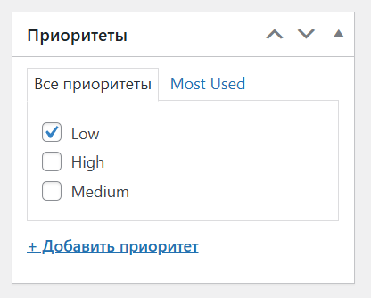
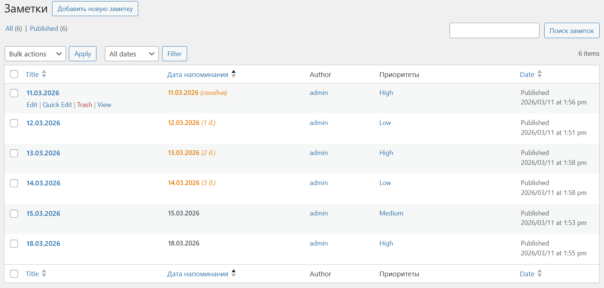
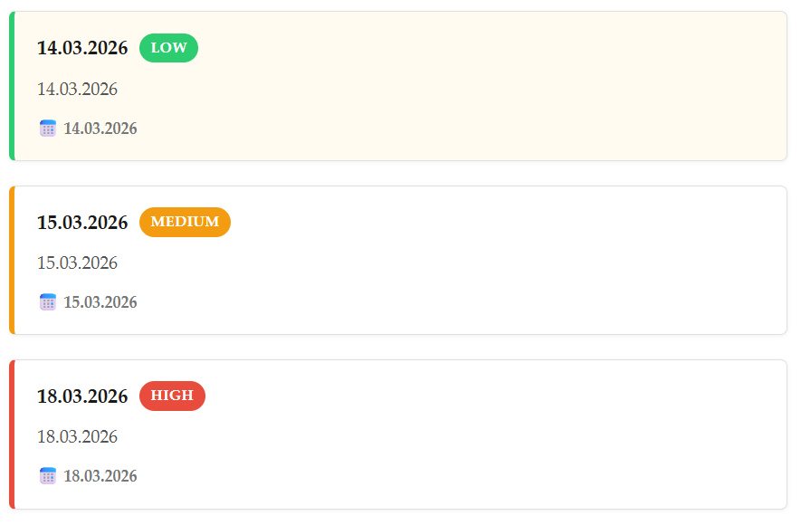
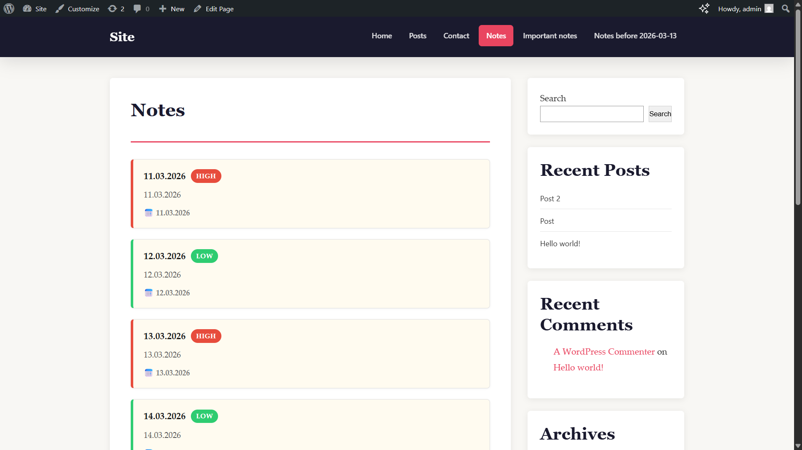
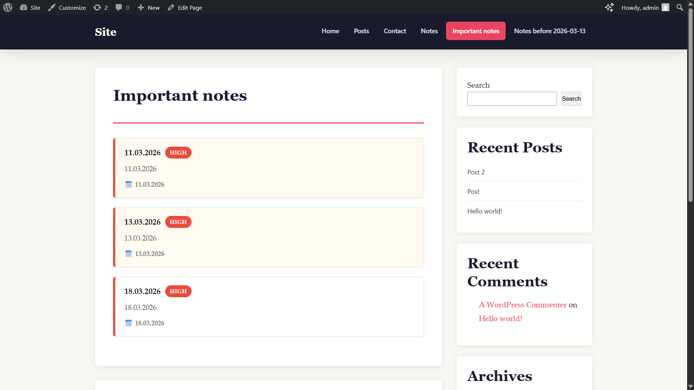
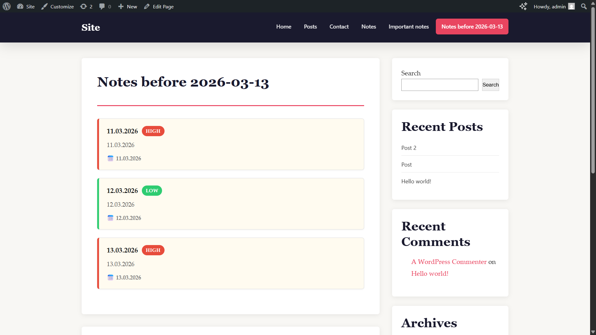

# USM Notes — WordPress Plugin

**Версия:** 1.0.0  
**Автор:** Alex / USM  
**Требования:** WordPress 5.8+, PHP 7.4+

---

## Установка

1. Скопировать папку `usm-notes` в `wp-content/plugins/`.
2. Активировать плагин в разделе «Плагины» в wp-admin.
3. Включить отладку в `wp-config.php`:
   ```php
   define('WP_DEBUG', true);
   ```
4. Перейти в «Заметки» в боковом меню, добавить термины таксономии (High / Medium / Low).

---

## Описание

Плагин добавляет в WordPress:

- **Custom Post Type `usm_note`** — раздел «Заметки» с поддержкой заголовка, редактора, автора и миниатюры.
- **Таксономию `note_priority`** — иерархические приоритеты (High, Medium, Low), связанные с CPT.
- **Метабокс «Дата напоминания»** — поле выбора даты с валидацией (дата не в прошлом, обязательно), защита через nonce.
- **Колонку «Дата напоминания»** в списке заметок с цветовой индикацией (просрочено / скоро / в норме) и сортировкой.
- **Шорткод `[usm_notes]`** для отображения заметок на фронтенде.

---

## Шорткод

```
[usm_notes]
[usm_notes priority="high"]
[usm_notes before_date="2025-03-13"]
[usm_notes priority="medium" before_date="2025-06-01"]
```

| Параметр      | Описание                                         |
|---------------|--------------------------------------------------|
| `priority`    | Слаг приоритета: `high`, `medium`, `low`         |
| `before_date` | Показать только заметки с датой ≤ указанной (`YYYY-MM-DD`) |

Если параметры не указаны — отображаются все заметки. Если заметок нет — выводится сообщение «Нет заметок с заданными параметрами».

---

## Структура файлов

```
usm-notes/
├── usm-notes.php          # Основной файл плагина
├── assets/
│   └── style.css          # Стили шорткода
└── includes/
    ├── cpt.php            # Регистрация CPT
    ├── taxonomy.php       # Регистрация таксономии
    ├── metabox.php        # Метабокс с датой напоминания
    ├── columns.php        # Кастомные колонки и сортировка
    └── shortcode.php      # Шорткод [usm_notes]
```
## Скриншоты
### Раздел: Добавить новую заметку

### Иерархические приоритеты

### Тестовые данные

### Графическое отабражение приоритетов

### Шорткод: [usm_notes]

### Шорткод: [usm_notes priority="high"]

### Шорткод: [usm_notes before_date="2025-03-13"]


---

## Ответы на контрольные вопросы

### 1. Чем пользовательская таксономия принципиально отличается от метаполя?

**Таксономия** — это набор заранее определённых классификаторов (терминов), общих для многих записей. Она поддерживает архивные страницы, фильтрацию через `WP_Query` по `tax_query`, отображается как отдельный раздел в меню и позволяет группировать записи.

**Метаполе** — произвольное значение, уникальное для конкретной записи, не предполагающее общей классификации.

**Пример выбора:**
- Приоритет заметки (High / Medium / Low) — **таксономия**, так как значения фиксированы и переиспользуются между заметками.
- Дата напоминания — **метаполе**, так как значение уникально для каждой записи и не является классификатором.

---

### 2. Зачем нужен nonce при сохранении метаполей?

**Nonce (number used once)** — одноразовый токен, привязанный к пользователю, времени и действию. Он защищает от **CSRF-атак** (Cross-Site Request Forgery): злоумышленник не сможет заставить браузер жертвы отправить поддельный POST-запрос к `/wp-admin/post.php`, потому что не знает актуального nonce.

Без проверки nonce любой сайт может незаметно отправить форму с нужными данными от имени залогиненного администратора, что позволит изменить метаданные любой записи.

В плагине использованы `wp_nonce_field()` для генерации и `wp_verify_nonce()` для проверки.

---

### 3. Какие аргументы `register_post_type()` и `register_taxonomy()` важны для фронтенда и UX?

| Аргумент | Где используется | Почему важен |
|---|---|---|
| `rewrite['slug']` | `register_post_type`, `register_taxonomy` | Определяет ЧПУ (красивые URL) для архивов и отдельных записей. Плохой slug — некрасивые URL, проблемы с SEO |
| `has_archive` | `register_post_type` | Включает страницу архива (`/notes/`) — пользователи и поисковики могут просматривать все записи CPT |
| `public` | оба | Если `false` — CPT/таксономия не отображаются на фронтенде вообще: нет архивов, нет одиночных страниц, нет виджетов поиска |
| `show_in_rest` | оба | Включает поддержку REST API и редактора Gutenberg — без него блочный редактор не работает с CPT |
| `labels` | оба | Все надписи в интерфейсе (кнопки, сообщения) — плохие labels делают интерфейс непонятным для редакторов |

---

## Использованные источники

1. WordPress Developer Reference — `register_post_type()`: https://developer.wordpress.org/reference/functions/register_post_type/
2. WordPress Developer Reference — `register_taxonomy()`: https://developer.wordpress.org/reference/functions/register_taxonomy/
3. WordPress Developer Reference — `add_meta_box()`: https://developer.wordpress.org/reference/functions/add_meta_box/
4. WordPress Developer Reference — `wp_nonce_field()`, `wp_verify_nonce()`: https://developer.wordpress.org/apis/security/nonces/
5. WordPress Developer Reference — `add_shortcode()`: https://developer.wordpress.org/reference/functions/add_shortcode/
6. WordPress Developer Reference — `WP_Query`: https://developer.wordpress.org/reference/classes/wp_query/
