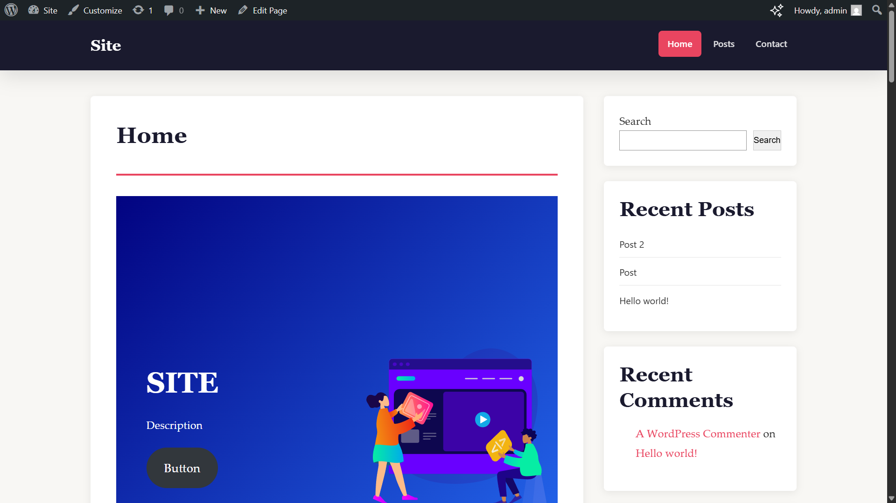

# USM Theme — WordPress Theme

> Лабораторная работа №3 · Разработка простой темы WordPress · USM

---

## 📋 Описание

**USM Theme** — это чистая, современная тема для WordPress, созданная в рамках лабораторной работы №3 по дисциплине «Веб-разработка» в USM. Тема обладает адаптивным двухколоночным макетом, поддержкой боковой панели, кастомной типографикой и полным набором шаблонов блога.

### Особенности темы
- 🎨 **Редакционный дизайн** — тёмная шапка, акцентный красный цвет, сериф-типографика
- 📱 **Адаптивная вёрстка** — корректно отображается на мобильных, планшетах и десктопах
- 💬 **Полная поддержка комментариев** — вложенные комментарии, форма ответа
- 🔧 **Widget Areas** — боковая панель + 3 области в подвале
- ⚡ **Оптимизация** — отключены лишние emoji-скрипты, подключение стилей через `wp_enqueue_style`

---

## 🚀 Инструкции по запуску

### Требования
- PHP ≥ 7.4
- WordPress ≥ 6.0
- Локальный сервер: [LocalWP](https://localwp.com/), XAMPP, MAMP или аналог

### Установка

```bash
# 1. Клонировать репозиторий в папку тем WordPress
cd /path/to/wordpress/wp-content/themes/
git clone https://github.com/<username>/usm-theme.git

# 2. Перейти в панель администратора
# Внешний вид → Темы → Найти "USM Theme" → Активировать
```

### Включение режима отладки (опционально)
В файле `wp-config.php` добавить или изменить:
```php
define('WP_DEBUG', true);
define('WP_DEBUG_LOG', true);
define('WP_DEBUG_DISPLAY', false);
```

---

## 📁 Структура темы

```
usm-theme/
├── style.css          # Метаданные темы + все CSS стили
├── functions.php      # Настройки темы, регистрация меню, виджетов, enqueue
├── index.php          # Главный шаблон (список записей)
├── single.php         # Шаблон отдельного поста
├── page.php           # Шаблон статической страницы
├── archive.php        # Шаблон архивов (категории, даты, теги)
├── header.php         # Шапка сайта (doctype → открытие <main>)
├── footer.php         # Подвал + вызов wp_footer()
├── sidebar.php        # Боковая панель с виджетами
├── comments.php       # Список комментариев + форма
└── screenshot.png     # Превью темы (1200×900px)
```

---

## 📖 Краткая документация

### Шаблоны и иерархия

| Файл | Назначение |
|---|---|
| `index.php` | Отображает список постов с пагинацией; фолбэк для всех типов |
| `single.php` | Полный текст одного поста + навигация prev/next |
| `page.php` | Содержимое статической страницы WordPress |
| `archive.php` | Посты по категории / тегу / автору / дате |
| `header.php` | Подключается через `get_header()` |
| `footer.php` | Подключается через `get_footer()` |
| `sidebar.php` | Подключается через `get_sidebar()` |
| `comments.php` | Подключается через `comments_template()` |

### Зарегистрированные области виджетов

| ID | Расположение |
|---|---|
| `sidebar-1` | Основная правая боковая панель |
| `footer-1` | Левая колонка подвала |
| `footer-2` | Центральная колонка подвала |
| `footer-3` | Правая колонка подвала |

### Зарегистрированные меню

| Расположение | Название |
|---|---|
| `primary` | Основное навигационное меню (в шапке) |
| `footer` | Меню в подвале |

---

## 🖼 Примеры использования

### Добавление виджетов в боковую панель
1. Администратор → **Внешний вид → Виджеты**
2. Перетащить виджеты в область **«Main Sidebar»**

### Настройка меню
1. Администратор → **Внешний вид → Меню**
2. Создать меню и назначить его на расположение **«Primary Menu»**

### Вывод 5 последних записей вручную (в шаблоне)
```php
$args = [
    'posts_per_page' => 5,
    'post_status'    => 'publish',
];
$query = new WP_Query($args);
if ($query->have_posts()) :
    while ($query->have_posts()) : $query->the_post();
        the_title('<h2>', '</h2>');
        the_excerpt();
    endwhile;
    wp_reset_postdata();
endif;
```

---

### Результат



---

## ❓ Ответы на контрольные вопросы

**1. Какие два файла являются обязательными для любой темы WordPress?**

`style.css` и `index.php`. `style.css` содержит обязательные метаданные темы (Theme Name, Author и др.) без которых WordPress не распознает тему. `index.php` — главный шаблон-фолбэк, который используется если не найден более специфичный шаблон.

**2. Как подключаются общие части шаблонов (header, footer, sidebar)?**

Через специальные функции WordPress:
- `get_header()` — подключает `header.php`
- `get_footer()` — подключает `footer.php`
- `get_sidebar()` — подключает `sidebar.php`
- `get_template_part('template-parts/content', 'post')` — для произвольных частей

**3. Чем отличаются index.php, single.php и page.php?**

- `index.php` — фолбэк для любого типа контента; обычно выводит список постов
- `single.php` — отображает **один пост** (`post_type = 'post'`) со всем содержимым
- `page.php` — отображает статическую **страницу** (`post_type = 'page'`), обычно без даты и метаданных

**4. Зачем нужен файл functions.php в теме?**

`functions.php` — это «загрузчик» темы. Он подключается автоматически WordPress при каждом запросе. В нём регистрируются: поддерживаемые возможности темы (`add_theme_support`), навигационные меню (`register_nav_menus`), области виджетов (`register_sidebar`), подключаются стили и скрипты через хуки (`wp_enqueue_scripts`), добавляются кастомные функции и фильтры.

---

## 📚 Список использованных источников

1. [WordPress Theme Developer Handbook](https://developer.wordpress.org/themes/)
2. [WordPress Template Hierarchy](https://developer.wordpress.org/themes/basics/template-hierarchy/)
3. [wp_enqueue_style() — WordPress Developer Resources](https://developer.wordpress.org/reference/functions/wp_enqueue_style/)
4. [register_sidebar() — WordPress Developer Resources](https://developer.wordpress.org/reference/functions/register_sidebar/)
5. [comments_template() — WordPress Developer Resources](https://developer.wordpress.org/reference/functions/comments_template/)
6. [WordPress Coding Standards](https://developer.wordpress.org/coding-standards/wordpress-coding-standards/)
